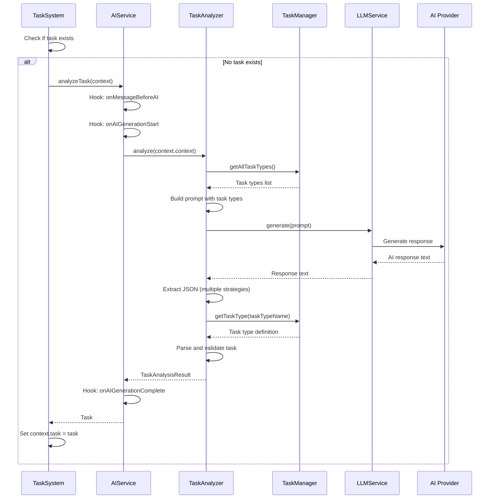
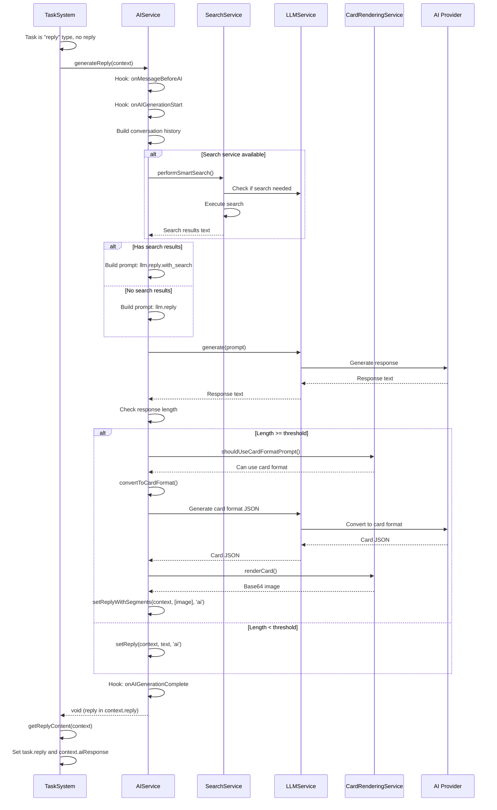
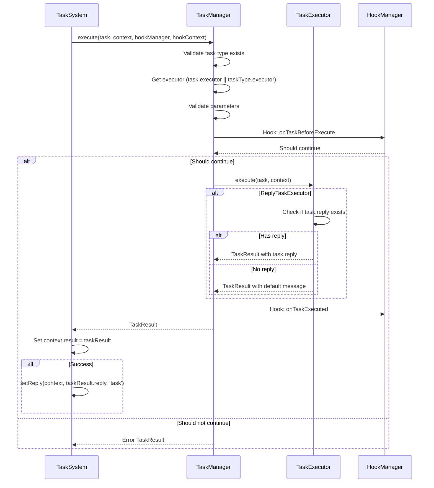
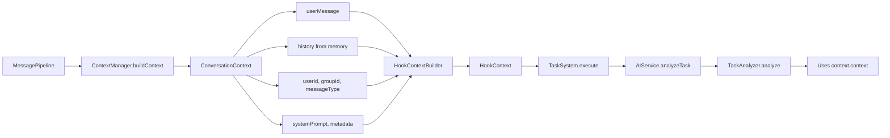
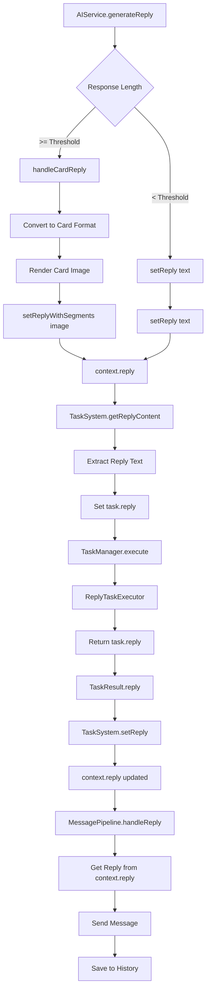

# Task System Architecture Documentation

## Overview

The Task System is a core component of the conversation processing pipeline that uses AI to analyze user messages and execute appropriate tasks. It consists of three main components:

1. **TaskAnalyzer** - Uses AI to analyze conversation and generate tasks
2. **TaskSystem** - Orchestrates task generation and execution
3. **TaskManager** - Manages task types and executors

## Component Responsibilities

### TaskAnalyzer

**Location**: `src/task/TaskAnalyzer.ts`

**Purpose**: Analyzes user messages using AI to determine what task should be executed.

**Key Methods**:
- `analyze(context: ConversationContext): Promise<TaskAnalysisResult>` - Main analysis method

**How it works**:
1. Builds a prompt using task type definitions from TaskManager
2. Calls LLM service to analyze the conversation
3. Extracts JSON task definition from AI response (handles multiple formats)
4. Parses and validates the task
5. Returns TaskAnalysisResult with the generated task

**Key Features**:
- Supports multiple JSON extraction strategies (handles reasoning models like Doubao)
- Validates task types against registered types
- For "reply" tasks, never pre-generates reply content (lets AIService handle it)
- Falls back to "reply" task if analysis fails

### TaskSystem

**Location**: `src/conversation/systems/TaskSystem.ts`

**Purpose**: System that orchestrates task generation and execution in the PROCESS stage.

**Key Methods**:
- `execute(context: HookContext): Promise<boolean>` - Main execution method

**How it works**:
1. Checks if command was already processed (skip if yes)
2. Checks if reply already exists (skip if yes)
3. Checks if post-processing only (skip task generation if yes)
4. If no task exists, calls `AIService.analyzeTask()` to generate one
5. If still no task, creates default "reply" task
6. Triggers `onTaskAnalyzed` hook
7. If task is "reply" type and has no reply, calls `AIService.generateReply()` or `AIService.generateReplyWithVision()`
8. Executes task through TaskManager
9. Sets reply to context using `setReply()`

**System Properties**:
- Stage: `SystemStage.PROCESS`
- Priority: 20 (executes after CommandSystem which has priority 100)

### TaskManager

**Location**: `src/task/TaskManager.ts`

**Purpose**: Manages task type registrations and task execution.

**Key Methods**:
- `registerTaskType(taskType: TaskType)` - Register a task type
- `registerExecutor(executor: TaskExecutor)` - Register an executor
- `execute(task, context, hookManager, hookContext)` - Execute a task

**How it works**:
1. Validates task type exists
2. Gets executor for the task
3. Validates parameters
4. Triggers `onTaskBeforeExecute` hook
5. Executes task using the executor
6. Triggers `onTaskExecuted` hook
7. Returns TaskResult

### AIService Integration

**Location**: `src/ai/AIService.ts`

**Key Methods Used by TaskSystem**:
- `analyzeTask(context: HookContext): Promise<Task | null>` - Analyzes conversation and generates task
- `generateReply(context: HookContext): Promise<void>` - Generates AI reply (sets to context.reply)
- `generateReplyWithVision(context, images): Promise<void>` - Generates AI reply with vision support

**How AIService works**:
1. `analyzeTask()`:
   - Calls `TaskAnalyzer.analyze()` with `context.context` (ConversationContext)
   - Returns the generated Task or null

2. `generateReply()`:
   - Builds conversation history
   - Performs smart search if available
   - Generates reply using LLM
   - Handles card rendering if response is long
   - Sets reply to `context.reply` using `setReply()` or `setReplyWithSegments()`
   - Returns void (reply is in context)

## Complete Flow

### Message Processing Pipeline

```mermaid
flowchart TD
    A[MessagePipeline.process] --> B[Lifecycle.execute]
    B --> C[Stage 1: ON_MESSAGE_RECEIVED]
    C --> D[Hook: onMessageReceived]
    D --> E[Stage 2: PREPROCESS]
    E --> F[Hook: onMessagePreprocess]
    F --> G[CommandRouter.route]
    G --> H{Is Command?}
    H -->|Yes| I[CommandSystem priority 100]
    I --> J[Execute Command]
    J --> K[Set Reply to Context]
    H -->|No| L[Stage 3: PROCESS]
    K --> L
    L --> M[TaskSystem priority 20]
    M --> N{Command Processed?}
    N -->|Yes| Z[Skip]
    N -->|No| O{Reply Exists?}
    O -->|Yes| Z
    O -->|No| P{Post Process Only?}
    P -->|Yes| Z
    P -->|No| Q{Task Exists?}
    Q -->|No| R[AIService.analyzeTask]
    R --> S[TaskAnalyzer.analyze]
    S --> T[Build Prompt]
    T --> U[LLM Service]
    U --> V[Extract JSON Task]
    V --> W[Parse Task]
    W --> X[Set context.task]
    Q -->|Yes| Y[Use Existing Task]
    X --> Y
    Y --> AA[Hook: onTaskAnalyzed]
    AA --> AB{Task Type Reply?}
    AB -->|Yes| AC{Has Reply?}
    AC -->|No| AD{Has Images?}
    AD -->|Yes| AE[AIService.generateReplyWithVision]
    AD -->|No| AF[AIService.generateReply]
    AE --> AG[Get Reply from context.reply]
    AF --> AG
    AG --> AH[Set task.reply]
    AC -->|Yes| AI[Skip Reply Generation]
    AB -->|No| AI
    AH --> AJ[TaskManager.execute]
    AI --> AJ
    AJ --> AK[Validate Task Type]
    AK --> AL[Get Executor]
    AL --> AM[Validate Parameters]
    AM --> AN[Hook: onTaskBeforeExecute]
    AN --> AO[Executor.execute]
    AO --> AP[Hook: onTaskExecuted]
    AP --> AQ[Set context.result]
    AQ --> AR{Success?}
    AR -->|Yes| AS[setReply context taskResult.reply]
    AR -->|No| AT[Error Handling]
    AS --> AU[Stage 4: PREPARE]
    AT --> AU
    AU --> AV[Hook: onMessageBeforeSend]
    AV --> AW[Stage 5: SEND]
    AW --> AX[MessagePipeline.handleReply]
    AX --> AY[Get Reply from context.reply]
    AY --> AZ[Send Message via API]
    AZ --> BA[Save to History]
    BA --> BB[Stage 6: COMPLETE]
    BB --> BC[Hook: onMessageSent]
    Z --> AU
```



## Detailed Component Interactions

### TaskAnalyzer → AIService → TaskSystem



### TaskSystem → AIService → Reply Generation



### TaskSystem → TaskManager → Executor



## Data Flow

### ConversationContext Flow



### Reply Flow



## Key Design Decisions

### 1. Why TaskSystem calls AIService.analyzeTask()?

- **Separation of Concerns**: TaskAnalyzer focuses on AI analysis, TaskSystem orchestrates the flow
- **Reusability**: AIService can be used by other systems
- **Hook Integration**: AIService handles AI-related hooks (onMessageBeforeAI, onAIGenerationStart, etc.)

### 2. Why TaskSystem generates reply for "reply" tasks?

- **Lazy Generation**: Reply is only generated when needed (not during task analysis)
- **Search Integration**: Allows AIService.generateReply() to use search service
- **Card Rendering**: Allows AIService to handle card rendering logic
- **Consistency**: All AI generation goes through AIService

### 3. Why reply is set to context.reply instead of returned?

- **Unified Interface**: All systems (CommandSystem, TaskSystem, PluginSystem) set reply to context
- **Segments Support**: Can handle complex messages (images, text, etc.)
- **Pipeline Integration**: MessagePipeline reads from context.reply
- **No Return Value Needed**: Context is the single source of truth

### 4. Why TaskAnalyzer doesn't pre-generate reply for "reply" tasks?

- **Search Logic**: AIService.generateReply() handles search integration
- **Card Rendering**: AIService handles card rendering for long responses
- **Template Consistency**: Uses same prompt templates as direct AI calls
- **Separation**: Task analysis and reply generation are separate concerns

## Hook Integration

### Hooks Triggered by TaskSystem

1. **onTaskAnalyzed** - Triggered when task is ready for execution
2. **onTaskBeforeExecute** - Triggered before task execution (by TaskManager)
3. **onTaskExecuted** - Triggered after task execution (by TaskManager)

### Hooks Triggered by AIService (via TaskSystem)

1. **onMessageBeforeAI** - Triggered before AI generation
2. **onAIGenerationStart** - Triggered when AI generation starts
3. **onAIGenerationComplete** - Triggered when AI generation completes

These hooks are declared by TaskSystem in `getExtensionHooks()` for plugin registration.

## Error Handling

### TaskAnalyzer Errors

- **JSON Extraction Fails**: Falls back to "reply" task with error message
- **Task Type Not Found**: Falls back to "reply" task
- **LLM Service Fails**: Returns fallback "reply" task

### TaskSystem Errors

- **AIService Not Available**: Sets fallback reply message
- **AI Generation Fails**: Sets error message to task.reply
- **Task Execution Fails**: TaskManager returns error TaskResult

### TaskManager Errors

- **Task Type Not Found**: Returns error TaskResult
- **Executor Not Found**: Returns error TaskResult
- **Parameter Validation Fails**: Returns error TaskResult
- **Executor Execution Fails**: Catches error and returns error TaskResult

## Example Flow: User Asks "今天天气怎么样？"

```
1. MessagePipeline.process()
   → Creates HookContext with ConversationContext

2. Lifecycle.execute()
   → Stage PROCESS: TaskSystem.execute()

3. TaskSystem.execute()
   → No command detected
   → No reply exists
   → Not post-process only
   → No task in context.task

4. AIService.analyzeTask(context)
   → TaskAnalyzer.analyze(context.context)
     → Build prompt with task types
     → LLM analyzes: "今天天气怎么样？"
     → AI returns: {"taskType": "reply", "parameters": {}}
     → Parse to Task: {type: "reply", executor: "reply"}

5. TaskSystem
   → Set context.task = task
   → Hook: onTaskAnalyzed
   → Task is "reply" type, no reply
   → Call AIService.generateReply(context)

6. AIService.generateReply(context)
   → Build conversation history
   → Perform smart search (if enabled)
   → Generate reply: "今天北京的天气是..."
   → Check length: 200 chars >= 200 threshold
   → handleCardReply() converts to card format
   → Render card image
   → setReplyWithSegments(context, [imageSegment], 'ai')

7. TaskSystem
   → getReplyContent(context) → get text from segments
   → Set task.reply = "今天北京的天气是..."
   → Call TaskManager.execute()

8. TaskManager.execute()
   → Get ReplyTaskExecutor
   → Execute: returns task.reply
   → Return TaskResult

9. TaskSystem
   → setReply(context, taskResult.reply, 'task')

10. MessagePipeline.handleReply()
    → getReplyContent(context)
    → Send card image message
    → Save to conversation history
```

## Summary

The Task System provides a flexible, AI-driven task execution framework:

1. **TaskAnalyzer** uses AI to analyze conversations and generate structured tasks
2. **TaskSystem** orchestrates task generation and execution in the message pipeline
3. **AIService** provides AI capabilities (analysis and reply generation)
4. **TaskManager** manages task types and executes tasks through executors
5. All components work together through the HookContext, ensuring unified reply handling

The system is designed for extensibility: new task types and executors can be registered without modifying core code.
